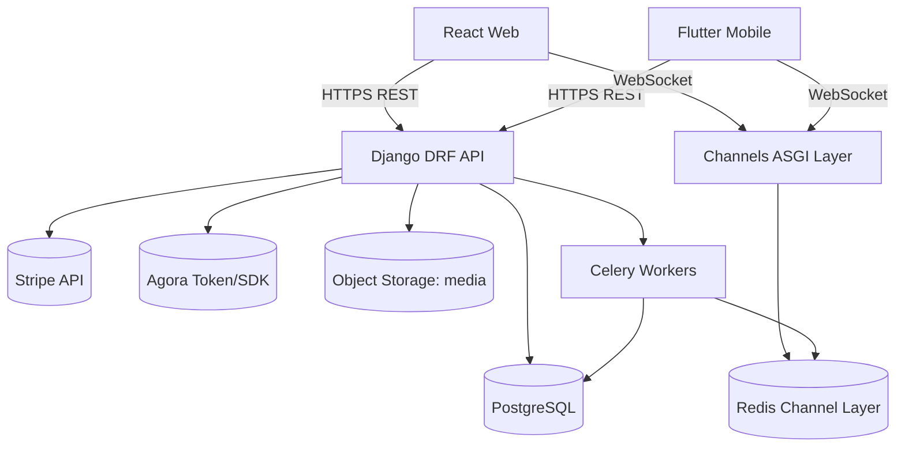

# I Doc App - Production Architecture

## 1) Target System Context

I Doc App is a multi-role healthcare platform with four personas:
- Admin
- Doctor
- Pharmacy
- General User (Patient)

Delivery channels:
- Web application (React)
- Mobile application (Flutter)
- Backend APIs (Django + DRF)
- Realtime transport (WebSocket + Redis)

Core non-functional goals:
- Security-first (JWT, RBAC, object-level permissions, audit trails)
- Modular domain architecture
- Horizontal scalability
- Observability and operational readiness

---

## 2) High-Level Architecture

---

## 3) Backend Service Boundaries (Django Apps)

Current apps are kept and evolved with strict responsibilities:

- apps.accounts
  - User identity, role model, onboarding, JWT auth, approval states, account status
- apps.administration
  - Approvals, account moderation (block/unblock), dispute workflows, ops dashboards
- apps.doctors
  - Doctor discovery, schedules/slots, doctor-facing dashboard and lifecycle
- apps.pharmacies
  - Pharmacy profile, medicine catalog, stock controls
- apps.bookings
  - Consultation booking lifecycle, consultation state machine, prescription linkage
- apps.orders
  - Cart/order workflows and medicine fulfillment lifecycle
- apps.payments
  - Payment intents, confirmations, webhook finalization, payout and refund state
- apps.chat
  - Chat room/message domain, websocket transport, video token endpoint
- apps.notifications
  - In-app notifications and event-driven user alerts

Proposed supporting apps for production hardening:
- apps.audit (immutable audit trails)
- apps.disputes (payment/service/order disputes)
- apps.compliance (consent, policy acceptance, legal records)

---

## 4) API Architecture & Security

### API style
- REST JSON for transactional and CRUD operations
- WebSockets for chat/presence/realtime updates

### Security controls
- JWT access + refresh using SimpleJWT
- Role-based permissions at endpoint level
- Object-level access checks for booking/order/chat ownership
- Account state gates:
  - deny blocked users
  - deny non-approved doctor/pharmacy from protected business actions
- Input validation with DRF serializers
- Stripe webhooks must be signature-verified

### Recommended auth/permission middleware enhancements
- Global permission mixin to enforce:
  - `is_active`
  - `not is_blocked`
  - role approval gates for doctor/pharmacy protected actions
- Endpoint throttling for login/register/payment endpoints

---

## 5) Realtime Architecture (Chat + Video)

### Chat
- Channels consumers by room
- Persistent message store in PostgreSQL
- Redis channel layer for multi-instance fanout

### Video consultation
- Agora token endpoint with short-lived tokens
- Consultation session mapping to booking id
- Token issue only when booking/payment state is authorized

---

## 6) Payment Architecture

Stripe-backed payment state machine:
- `pending` -> `processing` -> `completed` or `failed`
- `completed` can transition to `refunded` (admin/support flow)

Rules:
- Booking consultation activation only after completed payment
- Order fulfillment progression only after completed payment
- Webhook event is source-of-truth for final status updates

---

## 7) Scalability & Ops

### Horizontal scaling
- ASGI workers for websocket + API scaling
- Redis for channel fanout and Celery broker
- PostgreSQL with connection pooling (pgBouncer in production)

### Observability
- Structured JSON logs
- Request correlation IDs
- Error tracking (Sentry)
- Metrics dashboard (APM + DB + queue)

### Deployment
- Containerized services (backend + workers + redis)
- Environment-specific configuration
- Zero-downtime migration strategy

---

## 8) Current-State to Target-State Delta

Already present:
- Multi-role custom user model
- JWT auth endpoints
- Domain apps for bookings/orders/payments/chat/admin
- Stripe intent/confirm flow baseline
- Channels realtime baseline

Must harden/complete:
- Unified state machines (booking/order/payment)
- Full webhook-driven payment finalization
- Object-level permissions across all data access paths
- Admin dispute and refund controls
- Audit logging and compliance records
- Role-aware frontend parity across web/mobile

---

## 9) Build Strategy

Implementation order:
1. Domain correctness (models/state machine constraints)
2. Permission hardening and secure API contracts
3. Payment finalization and consultation gating
4. Realtime authorization + room ACL
5. Frontend role workflows (React + Flutter)
6. Observability, security hardening, and deployment readiness
