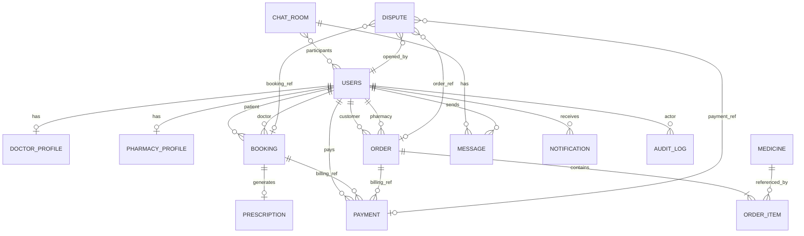

# I Doc App - Database Schema (PostgreSQL)

## 1) ERD (Logical)

---

## 2) Canonical Entities & Fields

### users (custom auth model)
- id (uuid, pk)
- email (unique, indexed)
- name
- phone
- role (enum: admin, doctor, pharmacy, general)
- is_approved (bool)
- is_blocked (bool)
- is_active (bool)
- avatar
- created_at, updated_at

Indexes:
- unique(email)
- index(role, is_approved)
- index(is_blocked)

### doctor_profile
- id (uuid, pk)
- user_id (fk users, one-to-one)
- specialization
- bio
- consultation_fee
- years_experience
- is_verified
- created_at, updated_at

### pharmacy_profile
- id (uuid, pk)
- user_id (fk users, one-to-one)
- license_number
- address
- is_verified
- created_at, updated_at

### medicine
- id (uuid, pk)
- pharmacy_id (fk users)
- name
- description
- category
- price
- stock
- requires_prescription
- is_active
- image
- created_at, updated_at

Indexes:
- index(pharmacy_id, is_active)
- index(name)
- index(category)

### booking
- id (uuid, pk)
- patient_id (fk users)
- doctor_id (fk users)
- date
- time_slot
- consultation_type (enum: video, chat)
- status (enum: pending, confirmed, in_progress, completed, cancelled)
- symptoms
- fee
- notes
- created_at, updated_at

Constraints:
- unique(doctor_id, date, time_slot)

Indexes:
- index(patient_id, created_at desc)
- index(doctor_id, date)
- index(status)

### prescription
- id (uuid, pk)
- booking_id (one-to-one fk booking)
- doctor_id (fk users)
- patient_id (fk users)
- diagnosis
- medicines (jsonb)
- notes
- created_at

### order
- id (uuid, pk)
- order_number (unique)
- customer_id (fk users)
- pharmacy_id (fk users)
- status (enum: pending, confirmed, preparing, ready, on_the_way, delivered, cancelled)
- subtotal
- delivery_fee
- total
- delivery_address
- prescription_image
- notes
- created_at, updated_at

Indexes:
- unique(order_number)
- index(customer_id, created_at desc)
- index(pharmacy_id, status)

### order_item
- id (uuid, pk)
- order_id (fk order)
- medicine_id (fk medicine)
- quantity
- unit_price
- line_total

### payment
- id (uuid, pk)
- user_id (fk users)
- payment_type (enum: booking, order)
- amount
- currency
- status (enum: pending, processing, completed, failed, refunded)
- provider (default stripe)
- provider_intent_id
- provider_charge_id
- booking_id (nullable fk)
- order_id (nullable fk)
- metadata (jsonb)
- created_at, updated_at

Constraints:
- one-of reference rule: booking_id xor order_id must be set

Indexes:
- index(user_id, created_at desc)
- index(status)
- unique(provider_intent_id)

### chat_room
- id (uuid, pk)
- room_type (enum: booking, support, direct)
- booking_id (nullable fk)
- created_at, updated_at

### message
- id (uuid, pk)
- room_id (fk chat_room)
- sender_id (fk users)
- content
- message_type (enum: text, image, file, system)
- created_at

Indexes:
- index(room_id, created_at)

### notification
- id (uuid, pk)
- user_id (fk users)
- type
- title
- body
- is_read
- payload (jsonb)
- created_at

Indexes:
- index(user_id, is_read, created_at desc)

### audit_log (new)
- id (uuid, pk)
- actor_id (nullable fk users)
- action
- entity_type
- entity_id
- before_state (jsonb)
- after_state (jsonb)
- ip_address
- user_agent
- created_at

### dispute (new)
- id (uuid, pk)
- opened_by_id (fk users)
- category (enum: payment, booking, order, account)
- status (enum: open, investigating, resolved, rejected)
- payment_id (nullable fk)
- booking_id (nullable fk)
- order_id (nullable fk)
- details
- resolution_notes
- created_at, updated_at

---

## 3) Booking + Payment Business Integrity

Recommended transactional rules:
- booking can move to `confirmed` only when linked payment is `completed`
- order can move beyond `pending` only when linked payment is `completed`
- payment status updates from webhook must be idempotent

---

## 4) Migration Plan (Safe Evolution)

Phase A:
- add missing indexes
- add `processing` payment status
- add `updated_at` where absent

Phase B:
- add audit_log and dispute tables
- add constraints for payment references

Phase C:
- add data migration scripts for historical payment/order normalization

---

## 5) Security Data Practices

- Store only minimum PII required
- Encrypt secrets via environment variables
- Never store card details (Stripe tokenization only)
- Add immutable audit records for admin/security-sensitive actions
